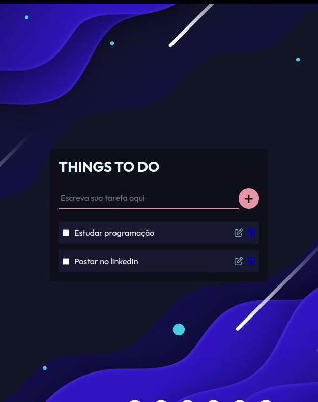

# TO-DO List

Projeto criado com o uso de PHP, JS e PostgreSQL.

Crie e gerencie suas tarefas de forma fácil e dinâmica.





## Rodando localmente

Clone o projeto

```bash
  git clone https://github.com/Vinicius149/To-do.git
```

Entre no diretório do projeto

```bash
  cd To-do
```

Inicie o servidor

```bash
  php -S localhost:8000
```

É necessário que você possua o PostgreSQL instalado em sua máquina, assim como criar um banco de dados com os dados que constam no arquivo /database/conn.php
## Funcionalidades

- Criação/exclusão de tarefas
- Edição de tarefas
- Acompanhamento de tarefas concluídas
- Design responsivo
- Multiplataforma


## Aprendizados

Aprendi a criar um sistema CRUD, executando operações que modificam o banco de dados, assim como criar do zero um sistema básico em PHP puro.

